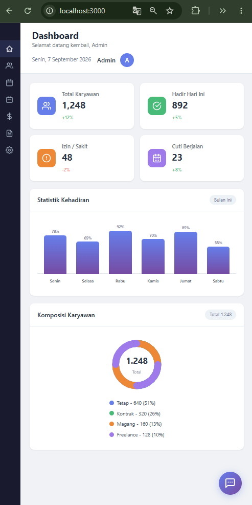
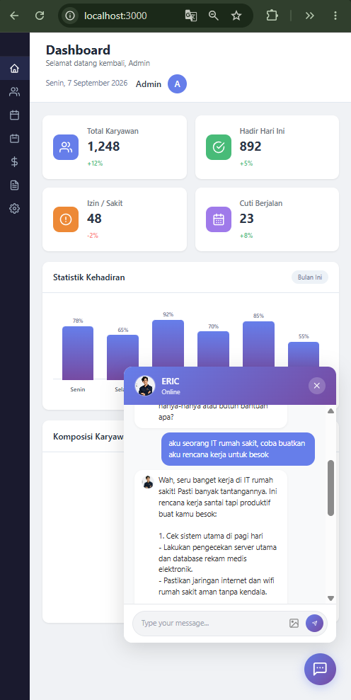

# HRIS Dashboard + Chatbot ERIC

Sistem Informasi Sumber Daya Manusia (HRIS) dengan dashboard interaktif dan chatbot AI bernama ERIC yang didukung oleh Google Gemini AI. (Namun data dari sistem HRIS nya masih dummy dan dalam pengembangan)

## Fitur

- **Dashboard HRIS** dengan statistik karyawan
- **Grafik Kehadiran** (Bar Chart)
- **Komposisi Karyawan** (Donut Chart)
- **Chatbot ERIC** - Asisten AI berbasis Gemini 3.5 Flash-Lite
- **Upload Gambar** ke chatbot
- **Responsive Design**
- **Dark Sidebar** dengan navigasi menu

## Teknologi

- Node.js
- Express.js
- Google Gemini AI API
- Tailwind CSS
- Vanilla JavaScript

- ## Screenshot

### Dashboard HRIS

*Tampilan utama dashboard HRIS dengan statistik karyawan, grafik kehadiran, dan komposisi karyawan.*

---

### Chatbot ERIC

*Chatbot ERIC yang siap membantu Anda kapan saja dengan tampilan floating widget di pojok kanan bawah.*
